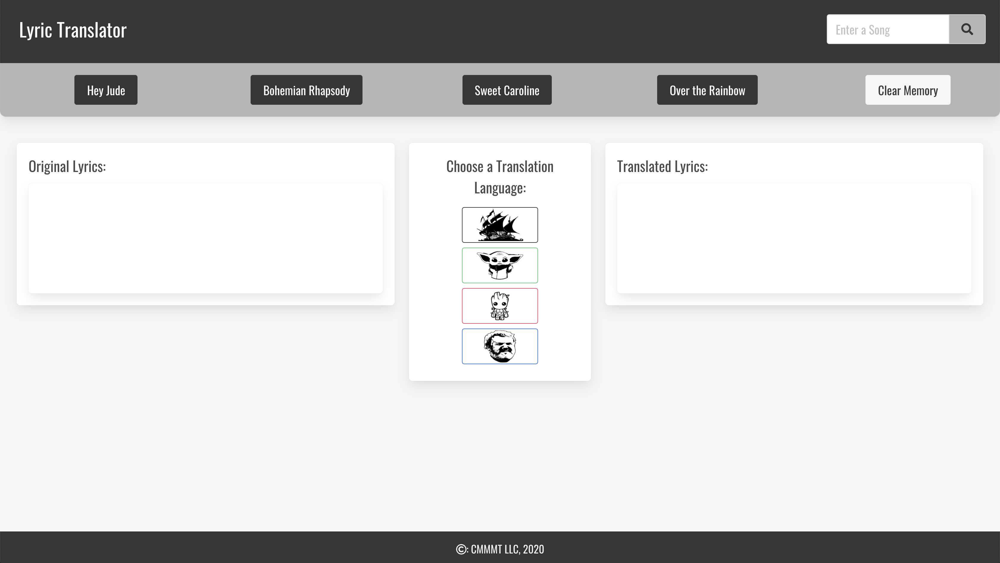
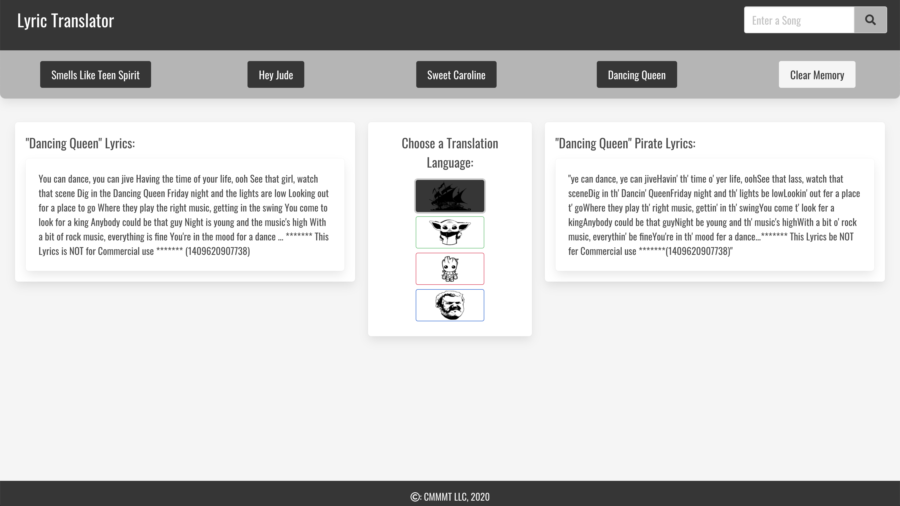
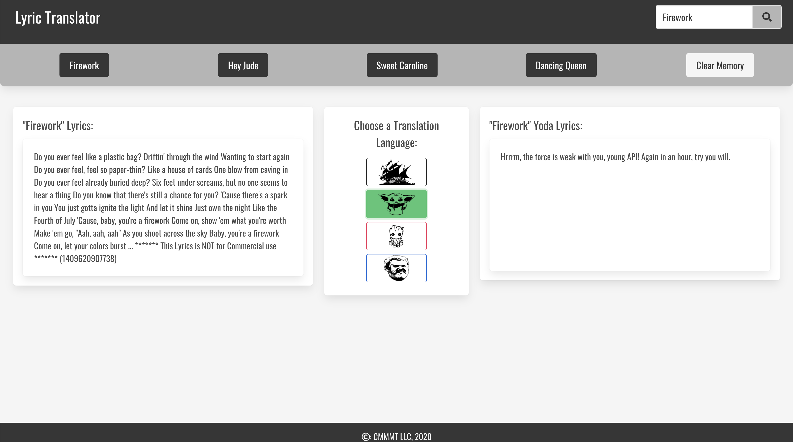

# Song Translation Application
### This is the repository for Project 1.
#### Group members: Curtis, Mark, Megan, Michaela & Tyler

## Overview
#### This Song Translation Application will utilize API's in order to provide the user with a fun and informative musical experience. The user experience within the browser will be enhanced by stylish CSS (powered by [Bulma](https://bulma.io/)), a user friendly HTML layout, and Javascript to dynamically update these elements. The decumentation of each API can be found using the links below:

##### [Provide Lyrics](https://developer.musixmatch.com/)
##### [Pirate Translator](https://api.funtranslations.com/translate/pirate)
##### [Yoda Translator](https://api.funtranslations.com/translate/yoda)
##### [Hodor Translator](https://api.funtranslations.com/translate/hodor)

## User Story

```
AS A human living through 2020
I WANT to be able to have a good laugh once in a while
SO THAT I have something to do besides bake sourdough bread and play Animal Crossing
```

## Application Features

```
GIVEN this Song Translator
WHEN I select a song or enter a title of my own
THEN the lyrics of the song will be presented to me
WHEN I click a button selecting a fun language
THEN the translation will appear next to the original lyrics
WHEN I enter a new song in the search bar
THEN the title will be saved to local storage to review later
WHEN I refresh the page
THEN four saved and/or suggested songs will be displayed on buttons
WHEN I click on a song button
THEN the lyrics to the song will be shown
WHEN I click the "clear songs" button
THEN my list of previously viewed songs will be deleted
```

### [Song Translation Application](https://curtis-hatter.github.io/Song-Translation-Application/)
### 
### 
### 
